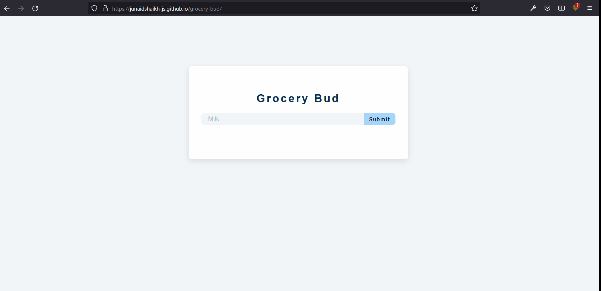

# 15 Vanilla JavaScript Projects

This project is a part of 15 vanilla JavaScript projects.

## Table of contents

- [Overview](#overview)
  - [Screenshot](#screenshot)
  - [Links](#links)
- [My process](#my-process)
  - [Built with](#built-with)
  - [What I learned](#what-i-learned)
- [Author](#author)

## Overview

### Screenshot



### Links

- [View live](https://junaidshaikh-js.github.io/grocery-bud/)

## My process

### Built with

- Semantic HTML5 markup
- CSS
- CSS Flexbox
- JavaScript

### What I learned

This projects is the complex as compared to all other projects. In this project, I worked with local storage to store the list items and to keep them even on refreshing the page.

Local Storage is pretty cool. We can easily store our data and get them whenever we want, but there are some restrictions.

Local Storage is nothing but an object. Yes, an regular object, but we only can store strings in this object. That's the restriction.

To store complex data structure such as arrays and objects, we need to convert them into strings using JSON methods.

1. JSON.stringify()

This method converts the JavaScript Object or value into string

```js
const person = [{ name: "junaid", lastName: "shaikh" }];

const stringVersion = JSON.stringify(person);
```

2. JSON.parse()

This method parses the JSON string and convert it into Object or value

```js
const person = JSON.parse(stringVersion);
```

Now, local storage can be access on window like this

```js
const localStorage = window.localStorage;
```

Local Storage has several methods that help us to add, remove, get values from it. Let's look at them one by one.

1. setItem()

This method is used to add item to the local storage. The syntax is

```js
localStorage.setItem("key", "value");
```

remember, the value must be a string.

2. getItem()

This method is used to get the value using the key.

```js
const list = localStorage.getItem("key");

// we need to convert the value into object or other value using JSON.parse() method

const list = JSON.parse(localStorage.getItem("key"));
```

3. clear()

This method is used to clear the local storage, this is, it removes all the local storage items.

```js
localStorage.clear();
```

4. removeItem()

To remove any particular item from the local storage use this method.

```js
localStorage.removeItem("myItem");
```

## Author

- Linkedin - [@junaidshaikhjs](https://www.linkedin.com/in/junaidshaikhjs/)
- Twitter - [@junaidshaikh_js](https://twitter.com/junaidshaikh_js)
